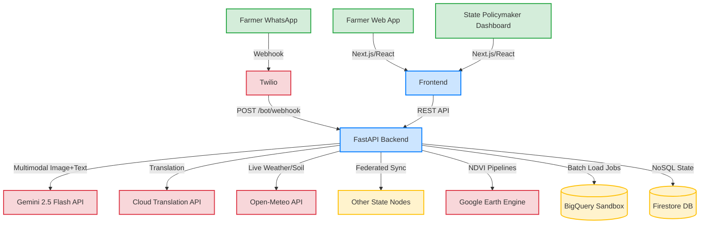

# 🌾 KrishiSathi — AI-Powered Agriculture Intelligence for Indian States

> **Built for [Build with AI: Code for Communities — Second Edition](https://hackathon-link) | Google Cloud Hackathon 2026**


[](https://opensource.org/licenses/Apache-2.0)
[](https://ai.google.dev/)
[]()

## 🎯 Problem Statement

**Track 4: AgriN & Regenerative Agricultural Intelligence (Cooperation)**

500+ million smallholder farmers across Indian states lack access to data-driven agricultural guidance. Relying on traditional methods instead of satellite data, soil-health analytics, and climate forecasting leads to crop failures that threaten food security. The absence of shared digital infrastructure blocks cross-state collaboration on climate-resilient farming.

## 💡 Solution

**KrishiSathi** is an interoperable, AI-powered digital agriculture network that delivers real-time, localized agro-advisories to smallholder farmers via voice, text, and image — designed as a scalable Digital Public Good.

### Key Features

| Feature | Description | Google AI Service |
|---|---|---|
| 📸 **Crop Disease Diagnosis** | Photograph a diseased crop → instant AI diagnosis with treatment plan | Gemini 2.5 Flash (Multimodal) |
| 💬 **Agro-Advisory Chat** | Ask farming questions → get contextual, personalized advice | Gemini 2.5 Flash |
| 🌍 **10+ Languages** | Voice and text support across all Indian languages | Cloud Translation, Speech-to-Text, Text-to-Speech |
| 🛰️ **Satellite Monitoring** | NDVI-based crop health tracking via satellite imagery | Google Earth Engine |
| ⚡ **Outbreak Alerts** | AI-detected disease clustering triggers farmer warnings | BigQuery ML |
| 📊 **Policymaker Dashboard** | Data-driven insights for agricultural ministries | BigQuery + Gemini |
| 🤝 **Indian Data Exchange** | Cross-border agricultural intelligence sharing protocol | Cloud Run APIs |

## 🏗️ Architecture

```
┌─────────────────────────────────────────────────────┐
│                  Farmer Interfaces                   │
│  WhatsApp Bot  │  Progressive Web App  │  Voice/SMS  │
└────────┬───────┴──────────┬───────────┴──────┬──────┘
         │                  │                  │
         ▼                  ▼                  ▼
┌─────────────────────────────────────────────────────┐
│              Cloud Run — FastAPI Backend             │
│  ┌──────────┐ ┌──────────┐ ┌──────────┐ ┌────────┐  │
│  │ Diagnose │ │ Advisory │ │  Alerts  │ │ Dashboard│ │
│  └────┬─────┘ └────┬─────┘ └────┬─────┘ └────┬───┘  │
│       │             │            │             │      │
│  ┌────▼─────────────▼────────────▼─────────────▼──┐  │
│  │           AI Intelligence Core                  │  │
│  │  Gemini 2.5 Flash │ Vertex AI │ Earth Engine   │  │
│  │  Translation API  │ STT/TTS  │ BigQuery ML    │  │
│  └────────────────────────────────────────────────┘  │
└─────────────────────────────────────────────────────┘
         │                  │                  │
         ▼                  ▼                  ▼
┌─────────────────────────────────────────────────────┐
│                  Data Sources                        │
│  FAO  │  Copernicus  │  OpenWeather  │  Soil Health  │
└─────────────────────────────────────────────────────┘
```

## 🚀 Quick Start

### Prerequisites

- Python 3.11+
- Node.js 18+
- Google AI Studio API Key ([Get one free](https://aistudio.google.com/apikey))

### Backend

```bash
cd backend
python -m venv venv
source venv/bin/activate  # On Windows: venv\Scripts\activate
pip install -r requirements.txt

# Set your Gemini API key
export GEMINI_API_KEY="your-api-key-here"

# Run the server
uvicorn main:app --reload --port 8000
```

### Frontend

```bash
cd frontend
npm install
npm run dev
```

Open [http://localhost:3000](http://localhost:3000) to see the app.

### Environment Variables

Copy `.env.example` to `.env` and fill in your credentials:

```bash
cp backend/.env.example backend/.env
```

| Variable | Required | Description |
|---|---|---|
| `GEMINI_API_KEY` | ✅ Yes | Google AI Studio API key |
| `OPENWEATHER_API_KEY` | Optional | OpenWeather API key for live weather |
| `GOOGLE_CLOUD_PROJECT` | Optional | GCP project for Translation, STT, TTS |
| `GOOGLE_MAPS_API_KEY` | Optional | Google Maps for interactive maps |

> **Note:** The app works with just the `GEMINI_API_KEY`. Other services fall back to mock data gracefully.

## System Architecture

KrishiSathi is designed as a scalable digital-public-good platform.



## 🌐 Cross-State Applicability

KrishiSathi is designed as a **Digital Public Good** that works across all Indian states:

| 🇮🇳 India | 🇧🇷 Brazil | 🇷🇺 Russia | 🇨🇳 China | 🇿🇦 South Africa |
|---|---|---|---|---|
| Hindi, Marathi, Tamil, Telugu, Bengali | Portuguese | Russian | Mandarin | English, Zulu |
| IMD Weather | INMET | Roshydromet | CMA | SAWS |
| Rice, Wheat, Cotton | Soybean, Coffee | Wheat, Barley | Rice, Corn | Maize, Sugarcane |

Adding a new country requires only:
1. Language code configuration
2. Weather API endpoint
3. Crop database for the region

## 🛠️ Technology Stack

### Google AI Services (Mandatory)
- **Gemini 2.5 Flash** — Multimodal crop disease diagnosis + advisory generation
- **Cloud Translation API** — 10+ Indian language support
- **Cloud Speech-to-Text** — Voice input from farmers
- **Cloud Text-to-Speech** — Audio advisory responses
- **Google Earth Engine** — Satellite NDVI analysis
- **Google Maps Platform** — Geospatial visualization
- **BigQuery** — Analytics and outbreak detection
- **Firebase** — Firestore (real-time DB) + Hosting
- **Cloud Run** — Serverless API deployment

### Application Stack
- **Backend:** Python 3.11, FastAPI, Pydantic
- **Frontend:** Next.js 14, TypeScript, Tailwind CSS
- **Database:** Firebase Firestore
- **Deployment:** Cloud Run + Firebase Hosting

## 📋 Submission Checklist

- [x] Source code — this repository
- [ ] Demo video — 3-5 minute walkthrough
- [ ] Pitch deck — 10-12 slides
- [x] Brief description — see above
- [ ] Deployed link — coming soon

## 👤 Team

**Solo Developer** — Built with ❤️ and AI for the global farming community.

## 📄 License

Apache License 2.0 — This project is a Digital Public Good.

---

*KrishiSathi: From photo to diagnosis in 5 seconds. Agriculture intelligence for everyone.* 🌾

## 🚀 Deployment (Zero-Billing Ready)

KrishiSathi is designed to run entirely on free tiers, specifically targeting the **Google Cloud Starter Tier** for hackathons.

### Option A: Google Cloud Starter Tier
1. **Frontend (Next.js):** Deploy to Cloud Run via source (uses Cloud Build free tier).
   ```bash
   gcloud run deploy krishisathi-web --source ./frontend --allow-unauthenticated
   ```
2. **Backend (FastAPI):** Deploy to Cloud Run via source.
   ```bash
   gcloud run deploy krishisathi-api --source ./backend --allow-unauthenticated
   ```
3. **Database:** Use Firestore in Native Mode (Default database is free tier).
4. **Data Warehouse:** Use BigQuery Sandbox (no credit card required, tables expire after 60 days).

### Option B: Fallback (Vercel & Render)
If Cloud Run is unavailable:
- **Frontend:** Import the `frontend` folder into Vercel.
- **Backend:** Deploy the `backend` folder to Render (Free Web Service) or Railway.

---

Built with ❤️ for the Indian AgriTech Hackathon.
