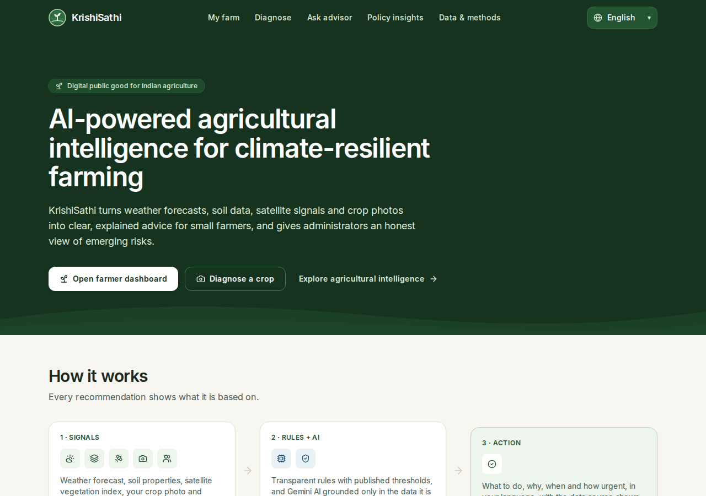
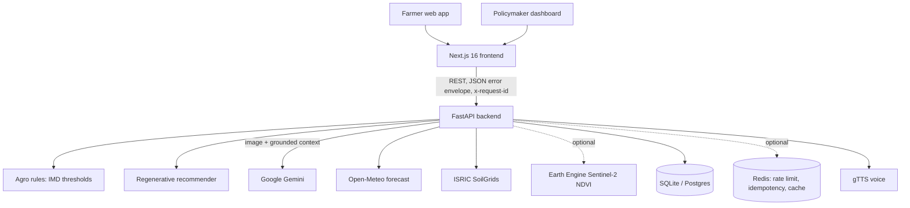

<div align="center">
  <h1>KrishiSathi (कृषि साथी)</h1>
  <p><strong>Trustworthy, multilingual agricultural intelligence for small farmers and the officials who support them.</strong></p>
  <p><a href="https://ai-krishisathi.vercel.app/">Live site</a> · <a href="#architecture">Architecture</a> · <a href="docs/AUDIT.md">Audit &amp; change log</a></p>
</div>

---



## What it does

| Farmers ask | KrishiSathi answers with | Based on |
|---|---|---|
| What should I do today? | Ranked risks and the one action that matters now | Open-Meteo forecast + published IMD thresholds |
| What will the weather do? | 7-day forecast translated into farming meaning (rain, heat, cold, fungal conditions, dry spells, spray wind) | Open-Meteo (model estimates, labelled as such) |
| What is wrong with my crop? | Diagnosis with **status** (disease / healthy / uncertain / not a plant), **certainty** (low / moderate / high), symptoms seen, alternatives and safe next steps | Gemini vision + curated ICAR disease reference |
| How can I improve my soil? | Regenerative practices ranked for the farm: why, what, when, expected benefit and the data behind it | ISRIC SoilGrids + Soil Health Card rating classes + forecast |
| Is there a risk nearby? | Weather alerts and disease clusters reported within ~100 km | Forecast rules + anonymised, AI-classified farmer reports |
| Where are risks rising? (policymakers) | Real counts, trends, clusters, per-state forecast risk and an AI briefing, each with source and limitations | Aggregated diagnoses (coarsened to ~11 km) |

Available in English, हिन्दी, मराठी, தமிழ், తెలుగు, বাংলা, ಕನ್ನಡ, ગુજરાતી, ਪੰਜਾਬੀ and മലയാളം with native scripts and numerals.

## Real data only

KrishiSathi never fills a gap with invented numbers.

* If a source fails or is not configured, the UI shows an explicit **unavailable** state and the API returns an error or `{"status": "unavailable"}`. There is no demo mode and no mock fallback.
* Every panel shows its **provenance**: source, kind (model estimate, forecast, satellite observation, AI-generated, verified reference, rule-based) and time.
* AI output is always labelled and kept separate from verified data. Chemical treatments are shown only when the diagnosis matches the curated reference and certainty is not low. Everything else directs the farmer to their KVK.
* Satellite crop health is shown only when Earth Engine is configured. Regional crop-health aggregation is not implemented, so the policy dashboard says so.
* Diagnosis accuracy has **not** been measured on an Indian field dataset. `backend/scripts/validate_plantvillage.py` can measure it.

## Architecture



**Backend** (`backend/`): FastAPI, async SQLAlchemy + Alembic, pydantic v2.

* `core/`: error envelope `{"error": {"code", "message", "request_id", "retryable"}}`, request-ID and security-header middleware, rate limiting (Redis with an in-process fallback), JWT auth that fails closed.
* `services/`: weather, agro rules, soil, regenerative practices, Earth Engine, Gemini (timeouts, schema validation, prompt-injection fencing), grounding context, persistence.
* `routers/`:
  * farmer: `/api/farm/*`, `/api/diagnose`, `/api/advisory/*`, `/api/alerts`, `/api/kvk`
  * policymaker: `/api/dashboard/*`, `/api/states/*`
  * metadata: `/api/sources`, `/health/live`, `/health/ready`

**Frontend** (`frontend/`): Next.js 16 App Router, React 19, Tailwind v4.

* Pages: `/`, `/farm`, `/diagnose`, `/advisor`, `/dashboard`, `/about`.
* `lib/api.ts` gives typed calls with timeouts and parses the error envelope.
* `lib/i18n.tsx` lazily loads locales and formats numbers in native numerals.
* Charts and maps load lazily.

## Running locally

```bash
# Backend
cd backend
python3 -m venv .venv && source .venv/bin/activate
pip install -r requirements.txt
cp .env.example .env          # set GEMINI_API_KEY; everything else is optional
alembic upgrade head
uvicorn main:app --reload --port 8000     # docs at http://localhost:8000/docs

# Frontend (new terminal)
cd frontend
npm ci
cp .env.example .env.local    # NEXT_PUBLIC_API_URL=http://localhost:8000
npm run dev                   # http://localhost:3000
```

See `backend/.env.example` for the backend environment variables:

* `GEMINI_API_KEY` and model overrides
* `DATABASE_URL`, `REDIS_URL`
* `JWT_SECRET`
* `CORS_ALLOWED_ORIGINS` / `CORS_ALLOWED_ORIGIN_REGEX`
* `EE_SERVICE_ACCOUNT_KEY_JSON`
* `AI_TIMEOUT_SECONDS`, `EXTERNAL_API_TIMEOUT_SECONDS`

In `ENVIRONMENT=production` the backend requires a real database and Redis.

## Validation

```bash
# Backend: 116 tests (the Postgres concurrency test runs in CI with a Postgres service)
cd backend && python -m pytest -q

# Frontend
cd frontend
npm run lint
npm run typecheck
npm test                      # locale integrity: keys, placeholders, no English leftovers, native numerals
npm run build
npx playwright install chromium   # once
npm run test:e2e              # user journeys on desktop and Pixel 7, against recorded API fixtures
```

End-to-end tests serve the production build and answer every API call from `frontend/e2e/fixtures/api.json`. That fixture was recorded from the real backend routes, so the tests are deterministic and need no network.

To capture screenshots for visual QA, run `SCREENSHOTS=1 SCREENSHOT_LANG=hi npx playwright test screenshots --project=desktop`.

After changing a locale, run `node scripts/localize-digits.mjs` to convert ASCII digits to native numerals.

## Data sources

| Source | Use | Notes |
|---|---|---|
| [Open-Meteo](https://open-meteo.com) | Current conditions, 7-day forecast, soil moisture, ET₀ | Model estimates, not station readings |
| [ISRIC SoilGrids 2.0](https://soilgrids.org) | pH, organic carbon, clay, sand (0–15 cm) | 250 m predictions; not a field test |
| India Meteorological Department | Heavy-rain, heat and cold thresholds | Used in `services/agro_rules.py` |
| Soil Health Card scheme | pH and organic-carbon rating classes | Used in `services/soil_service.py` |
| Google Earth Engine (optional) | Sentinel-2 NDVI around the farm | Unavailable unless a service account is configured |
| Google Gemini | Photo diagnosis, advisory, transcription, policy briefing | Always labelled AI-generated |
| `backend/data/disease_reference.json` | Curated disease symptoms and management (ICAR institutes) | Small and growing |
| `backend/data/kvk_locations.json` | Nearest Krishi Vigyan Kendra | Approximate; verify on the KVK portal |

## Limitations

* Translations are careful but should be reviewed by native-speaking agronomists.
* Disease clusters reflect where the app is used and are AI-classified, not lab-confirmed.
* The policy dashboard uses one forecast point per state for weather risk, so it is indicative only.

## License

[Apache License 2.0](LICENSE). KrishiSathi is positioned as a Digital Public Good. Built by Varad Pandare (IIT Kharagpur) for the Google Build with AI Hackathon.
