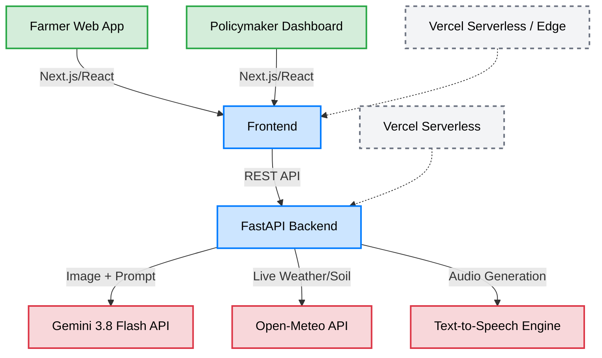

<div align="center">
  <h1>KrishiSathi (कृषि साथी)</h1>
  
  <p><strong>A zero-billing, multimodal AI diagnostic platform and voice-first advisory network for Indian agriculture.</strong></p>

  <p>
    <strong><a href="https://ai-krishisathi.vercel.app/" target="_blank">🔗 Live Demo Website</a></strong>
    &nbsp;&nbsp; | &nbsp;&nbsp;
    <strong><a href="#architecture">🏗️ View Architecture</a></strong>
  </p>
</div>

---


## The Problem
Indian farmers in low-resource areas face two major barriers to adopting modern agricultural tech: illiteracy and extreme linguistic diversity. Traditional apps rely heavily on text and English interfaces, leaving farmers unable to access critical crop diagnostics or weather advisories. **KrishiSathi** solves this by providing a hyper-localized, 100% voice-first interface that understands 10 regional Indian languages and diagnoses crop diseases from a single smartphone photo.

## Features
* **Multimodal RAG Diagnostics:** Upload a photo of a diseased crop, and the backend dynamically injects real-time weather and soil data (via Open-Meteo) into the Gemini 3.8 Flash prompt to generate a highly accurate, hyper-local treatment plan.
* **Voice-First Accessibility:** Features a custom client-side Voice Activity Detection (VAD) engine that auto-terminates recording upon silence, paired with a robust Text-to-Speech (TTS) audio streaming pipeline.
* **Strict Non-Romanized Localization:** AI prompt engineering enforces native Indic script outputs (e.g., pure Marathi/Hindi without Hinglish transliteration) and native numeral formatting across the UI.
* **Explicit Failure Semantics:** The system enforces strict API contracts — network or data failures trigger clear UI error states rather than silently substituting synthetic or default data. 

## Modes of Operation

* **Production Mode (`NEXT_PUBLIC_DEMO_MODE="false"`)**: Requires a fully configured backend with active API keys (Gemini, Open-Meteo). Explicitly fails with HTTP 503 errors if external measurement data (weather, satellite) is unavailable, preventing the silent display of fabricated data to farmers.
* **Demo Mode (`NEXT_PUBLIC_DEMO_MODE="true"`)**: An explicit UI-only mode that hydrates the dashboard and charts with hardcoded mock data for demonstration purposes without requiring a live backend.

## Limitations & External Dependencies
* **Earth Engine NDVI Pipeline**: The Sentinel-2 NDVI calculation requires a valid Google Earth Engine service account. If unauthenticated, the service will return an explicit `unavailable` status rather than mocked measurements.
* **BigQuery Telemetry**: Diagnosis logs are emitted via an asynchronous fire-and-forget task. If BigQuery is unconfigured, logs are safely dropped with a console warning.

## Architecture



## Tech Stack

| Domain | Technology |
|---|---|
| **Frontend** | Next.js 14, React 18, Tailwind CSS, Web Audio API |
| **Backend** | Python 3.11, FastAPI, Uvicorn, Google GenAI SDK |
| **AI / APIs** | Gemini 3.8 Flash, Open-Meteo, gTTS |
| **DevOps** | Vercel Serverless Functions (`vercel.json`), GitHub Actions |

## Running Locally

### 1. Clone the Repository
```bash
git clone https://github.com/varad-oss/krishisathi.git
cd krishisathi
```

### 2. Backend Setup (FastAPI)
```bash
cd backend
python3 -m venv venv
source venv/bin/activate
pip install -r requirements.txt

# Create environment file
echo 'GEMINI_API_KEY="your-api-key"' > .env

# Optional Model Configuration (defaults to 3.x series)
echo 'GEMINI_DIAGNOSIS_MODEL="gemini-3.8-flash"' >> .env
echo 'GEMINI_ADVISORY_MODEL="gemini-3.8-flash"' >> .env
echo 'GEMINI_TRANSLATION_MODEL="gemini-3.5-flash-lite"' >> .env
echo 'GEMINI_TRANSCRIPTION_MODEL="gemini-3.5-transcribe"' >> .env
echo 'GEMINI_AGENT_MODEL="gemini-3.8-flash"' >> .env

# Start the server on port 8000
uvicorn main:app --reload --port 8000
```
*API documentation will be available at [http://localhost:8000/docs](http://localhost:8000/docs).*

#### Knowledge Base & Provenance
KrishiSathi uses a deterministically grounded knowledge base located at `backend/data/disease_reference.json`.
- **Data Provenance:** All disease data and treatment guidelines are sourced directly from authoritative agricultural institutions (e.g., ICAR-IIRR, ICAR-IIWBR). The Gemini models use this strictly for reference and are instructed not to invent or hallucinate unsupported treatments or pesticide doses.
- **Regional Limitations:** While the system attempts to match crop and state contexts, highly localized state-specific datasets are still limited. If no state match is found, the system defaults to general crop-specific disease reference data.

### 3. Frontend Setup (Next.js)
In a new terminal tab:
```bash
cd frontend
npm install

# Point the frontend to the local backend
echo 'NEXT_PUBLIC_API_URL="http://localhost:8000"' > .env.local
# Set NEXT_PUBLIC_DEMO_MODE="true" to enable mock UI data without a backend
echo 'NEXT_PUBLIC_DEMO_MODE="false"' >> .env.local

# Start the frontend
npm run dev
```
*The app will be available at [http://localhost:3000](http://localhost:3000).*

## Challenges & What I'd Improve
**The Hardest Bug:** Bridging the streaming audio pipeline between Python and React was by far the toughest technical challenge. Initially, the FastAPI backend was returning audio as a chunked `StreamingResponse`. The browser's native `HTMLAudioElement` struggled to buffer the MP3 without a known `Content-Length` header, which subsequently caused React 18's strict-mode to aggressively unmount the component and throw full-screen `AbortError` crashes. I solved this by calculating the exact byte-size of the audio file in-memory on the backend before sending the response, and implementing a graceful `catch(e => e.name === 'AbortError')` block in the frontend state manager.

**Future Improvements:** Currently, the system utilizes an in-memory datastore and free-tier APIs to strictly maintain a zero-billing footprint. For a true production rollout to thousands of KVKs, I would replace the local state with a robust Redis caching layer and migrate the backend to a dedicated Kubernetes cluster to handle concurrent image processing loads.

## Team
**Solo Developer** — Architected and built entirely by Varad Pandare (IIT Kharagpur) for the Google Build with AI Hackathon.

## License
[Apache License 2.0](LICENSE) — This project is positioned as a Digital Public Good.
