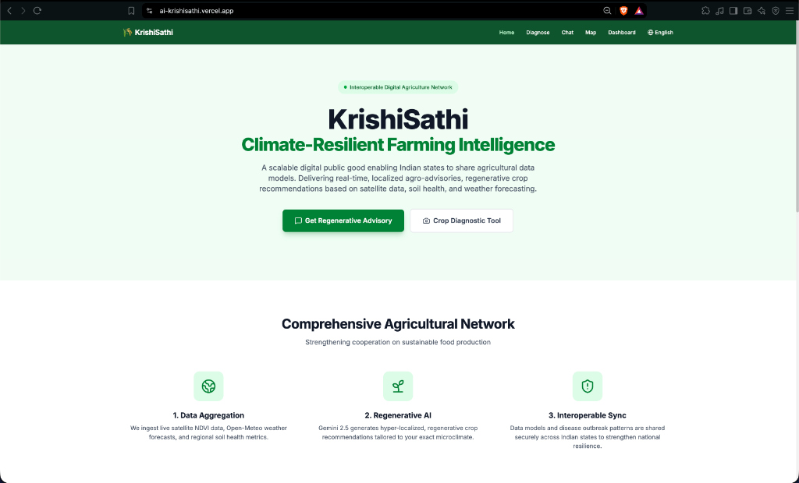

<div align="center">
  <h1>KrishiSathi (कृषि साथी)</h1>
  
  <p><strong>A zero-billing, multimodal AI diagnostic platform and voice-first advisory network for Indian agriculture.</strong></p>

  <a href="https://ai-krishisathi.vercel.app/" target="_blank">
    
  </a>
  
</div>

---



## The Problem
Indian farmers in low-resource areas face two major barriers to adopting modern agricultural tech: illiteracy and extreme linguistic diversity. Traditional apps rely heavily on text and English interfaces, leaving farmers unable to access critical crop diagnostics or weather advisories. **KrishiSathi** solves this by providing a hyper-localized, 100% voice-first interface that understands 10 regional Indian languages and diagnoses crop diseases from a single smartphone photo.

## Features
* **Multimodal RAG Diagnostics:** Upload a photo of a diseased crop, and the backend dynamically injects real-time weather and soil data (via Open-Meteo) into the Gemini 1.5 Flash prompt to generate a highly accurate, hyper-local treatment plan.
* **Voice-First Accessibility:** Features a custom client-side Voice Activity Detection (VAD) engine that auto-terminates recording upon silence, paired with a robust Text-to-Speech (TTS) audio streaming pipeline.
* **Strict Non-Romanized Localization:** AI prompt engineering enforces native Indic script outputs (e.g., pure Marathi/Hindi without Hinglish transliteration) and native numeral formatting across the UI.
* **Zero-Billing Edge Deployment:** Architected entirely on Vercel Serverless/Edge functions (`@vercel/python` for the FastAPI backend), scaling to $0 infrastructure cost when idle.

## Architecture


## Tech Stack

| Domain | Technology |
|---|---|
| **Frontend** | Next.js 14, React 18, Tailwind CSS, Web Audio API |
| **Backend** | Python 3.11, FastAPI, Uvicorn, Google GenAI SDK |
| **AI / APIs** | Gemini 1.5 Flash, Open-Meteo, gTTS |
| **DevOps** | Vercel Serverless Functions (`vercel.json`), GitHub Actions |

## Running Locally

### 1. Clone the Repository
```bash
git clone https://github.com/varad-oss/krishisathi.git
cd krishisathi
```

### 2. Backend Setup (FastAPI)
```bash
cd backend
python3 -m venv venv
source venv/bin/activate
pip install -r requirements.txt

# Create environment file
echo 'GEMINI_API_KEY="your-api-key"' > .env

# Start the server on port 8000
uvicorn main:app --reload --port 8000
```
*API documentation will be available at [http://localhost:8000/docs](http://localhost:8000/docs).*

### 3. Frontend Setup (Next.js)
In a new terminal tab:
```bash
cd frontend
npm install

# Point the frontend to the local backend
echo 'NEXT_PUBLIC_API_URL="http://localhost:8000"' > .env.local

# Start the frontend
npm run dev
```
*The app will be available at [http://localhost:3000](http://localhost:3000).*

## Challenges & What I'd Improve
**The Hardest Bug:** Bridging the streaming audio pipeline between Python and React was by far the toughest technical challenge. Initially, the FastAPI backend was returning audio as a chunked `StreamingResponse`. The browser's native `HTMLAudioElement` struggled to buffer the MP3 without a known `Content-Length` header, which subsequently caused React 18's strict-mode to aggressively unmount the component and throw full-screen `AbortError` crashes. I solved this by calculating the exact byte-size of the audio file in-memory on the backend before sending the response, and implementing a graceful `catch(e => e.name === 'AbortError')` block in the frontend state manager.

**Future Improvements:** Currently, the system utilizes an in-memory datastore and free-tier APIs to strictly maintain a zero-billing footprint. For a true production rollout to thousands of KVKs, I would replace the local state with a robust Redis caching layer and migrate the backend to a dedicated Kubernetes cluster to handle concurrent image processing loads.

## Team
**Solo Developer** — Architected and built entirely by Varad Pandare (IIT Kharagpur) for the Google Build with AI Hackathon.

## License
[Apache License 2.0](LICENSE) — This project is positioned as a Digital Public Good.
