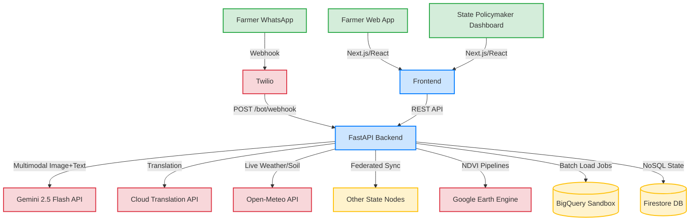

# 🌾 KrishiSathi — AI-Powered Agriculture Intelligence for Indian States

> **Built for [Build with AI: Code for Communities — Second Edition](https://hackathon-link) | Google Cloud Hackathon 2026**


[](https://opensource.org/licenses/Apache-2.0)
[](https://ai.google.dev/)
[]()

## 🎯 Problem Statement

**Track 4: AgriN & Regenerative Agricultural Intelligence (Cooperation)**

500+ million smallholder farmers across Indian states lack access to data-driven agricultural guidance. Relying on traditional methods instead of satellite data, soil-health analytics, and climate forecasting leads to crop failures that threaten food security. The absence of shared digital infrastructure blocks cross-state collaboration on climate-resilient farming.

## 💡 Solution

**KrishiSathi** is an interoperable, AI-powered digital agriculture network that delivers real-time, localized agro-advisories to smallholder farmers via voice, text, and image — designed as a scalable Digital Public Good.

### Key Features

| Feature | Description | Google AI Service |
|---|---|---|
| 📸 **Crop Disease Diagnosis** | Photograph a diseased crop → instant AI diagnosis with treatment plan | Gemini 2.5 Flash (Multimodal) |
| 💬 **Agro-Advisory Chat** | Ask farming questions → get contextual, personalized advice | Gemini 2.5 Flash |
| 🌍 **10+ Languages** | Voice and text support across all Indian languages | Cloud Translation, Speech-to-Text, Text-to-Speech |
| 🛰️ **Satellite Monitoring** | NDVI-based crop health tracking via satellite imagery | Google Earth Engine |
| ⚡ **Outbreak Alerts** | AI-detected disease clustering triggers farmer warnings | BigQuery ML |
| 📊 **Policymaker Dashboard** | Data-driven insights for agricultural ministries | BigQuery + Gemini |
| 🤝 **Indian Data Exchange** | Cross-border agricultural intelligence sharing protocol | Cloud Run APIs |

## 🏗️ Architecture

```
┌─────────────────────────────────────────────────────┐
│                  Farmer Interfaces                   │
│  WhatsApp Bot  │  Progressive Web App  │  Voice/SMS  │
└────────┬───────┴──────────┬───────────┴──────┬──────┘
         │                  │                  │
         ▼                  ▼                  ▼
┌─────────────────────────────────────────────────────┐
│              Cloud Run — FastAPI Backend             │
│  ┌──────────┐ ┌──────────┐ ┌──────────┐ ┌────────┐  │
│  │ Diagnose │ │ Advisory │ │  Alerts  │ │ Dashboard│ │
│  └────┬─────┘ └────┬─────┘ └────┬─────┘ └────┬───┘  │
│       │             │            │             │      │
│  ┌────▼─────────────▼────────────▼─────────────▼──┐  │
│  │           AI Intelligence Core                  │  │
│  │  Gemini 2.5 Flash │ Gemini 2.5 Pro            │  │
│  │  Function-Calling Agent │ RAG Grounding        │  │
│  │  Gemini Translation │ gTTS │ Earth Engine      │  │
│  └────────────────────────────────────────────────┘  │
└─────────────────────────────────────────────────────┘
         │                  │                  │
         ▼                  ▼                  ▼
┌─────────────────────────────────────────────────────┐
│                  Data Sources                        │
│  Open-Meteo  │  Sentinel-2  │  PlantVillage  │ KVK  │
└─────────────────────────────────────────────────────┘
```

## 🚀 Quick Start

### Prerequisites

- Python 3.11+
- Node.js 18+
- Google AI Studio API Key ([Get one free](https://aistudio.google.com/apikey))

### Backend

```bash
cd backend
python -m venv venv
source venv/bin/activate  # On Windows: venv\Scripts\activate
pip install -r requirements.txt

# Set your Gemini API key
export GEMINI_API_KEY="your-api-key-here"

# Run the server
uvicorn main:app --reload --port 8000
```

### Frontend

```bash
cd frontend
npm install
npm run dev
```

Open [http://localhost:3000](http://localhost:3000) to see the app.

### Environment Variables

Copy `.env.example` to `.env` and fill in your credentials:

```bash
cp backend/.env.example backend/.env
```

| Variable | Required | Description |
|---|---|---|
| `GEMINI_API_KEY` | ✅ Yes | Google AI Studio API key |
| `OPENWEATHER_API_KEY` | Optional | OpenWeather API key for live weather |
| `GOOGLE_CLOUD_PROJECT` | Optional | GCP project for Translation, STT, TTS |
| `GOOGLE_MAPS_API_KEY` | Optional | Google Maps for interactive maps |

> **Note:** The app works with just the `GEMINI_API_KEY`. Other services fall back to mock data gracefully.

## System Architecture

KrishiSathi is designed as a scalable digital-public-good platform.



## 🌐 Cross-State Coverage

KrishiSathi is designed as a **Digital Public Good** deployed across Indian states:

| State | Language | Primary Crops | KVKs Active |
|---|---|---|---|
| 🟢 Punjab | Punjabi | Wheat, Rice, Cotton | ✅ |
| 🟢 Maharashtra | Marathi | Cotton, Sugarcane, Soybean | ✅ |
| 🟢 Karnataka | Kannada | Rice, Ragi, Coffee | ✅ |
| 🟢 Tamil Nadu | Tamil | Rice, Banana, Groundnut | ✅ |
| 🟢 Uttar Pradesh | Hindi | Wheat, Rice, Potato | ✅ |
| 🟢 Madhya Pradesh | Hindi | Soybean, Wheat, Maize | ✅ |
| 🟢 Gujarat | Gujarati | Cotton, Groundnut, Cumin | ✅ |
| 🟢 West Bengal | Bengali | Rice, Jute, Tea | ✅ |

Adding a new state requires only:
1. State configuration entry in `/api/states/{code}/config`
2. Crop-disease reference mappings in `disease_reference.json`
3. KVK location data for the state's districts

## 🛠️ Technology Stack

### Google AI Services (Mandatory)
- **Gemini 2.5 Flash** — Multimodal crop disease diagnosis + advisory generation
- **Cloud Translation API** — 10+ Indian language support
- **Cloud Speech-to-Text** — Voice input from farmers
- **Cloud Text-to-Speech** — Audio advisory responses
- **Google Earth Engine** — Satellite NDVI analysis
- **Google Maps Platform** — Geospatial visualization
- **BigQuery** — Analytics and outbreak detection
- **Firebase** — Firestore (real-time DB) + Hosting
- **Cloud Run** — Serverless API deployment

### Application Stack
- **Backend:** Python 3.11, FastAPI, Pydantic
- **Frontend:** Next.js 14, TypeScript, Tailwind CSS
- **Database:** Firebase Firestore
- **Deployment:** Cloud Run + Firebase Hosting

## 📋 Submission Checklist

- [x] Source code — this repository
- [ ] Demo video — 3-5 minute walkthrough
- [ ] Pitch deck — 10-12 slides
- [x] Brief description — see above
- [ ] Deployed link — coming soon

## 👤 Team

**Solo Developer** — Built with ❤️ and AI for the global farming community.

## 📄 License

Apache License 2.0 — This project is a Digital Public Good.

---

*KrishiSathi: From photo to diagnosis in 5 seconds. Agriculture intelligence for everyone.* 🌾

## 🚀 Deployment (Zero-Billing Ready)

KrishiSathi is designed to run entirely on free tiers, specifically targeting the **Google Cloud Starter Tier** for hackathons.

### Option A: Google Cloud Starter Tier
1. **Frontend (Next.js):** Deploy to Cloud Run via source (uses Cloud Build free tier).
   ```bash
   gcloud run deploy krishisathi-web --source ./frontend --allow-unauthenticated
   ```
2. **Backend (FastAPI):** Deploy to Cloud Run via source.
   ```bash
   gcloud run deploy krishisathi-api --source ./backend --allow-unauthenticated
   ```
3. **Database:** Use Firestore in Native Mode (Default database is free tier).
4. **Data Warehouse:** Use BigQuery Sandbox (no credit card required, tables expire after 60 days).

### 🚀 How a New State Integrates

Adding a new state to the KrishiSathi network does not require code changes. The platform is designed to be configured entirely via the `/api/states/{code}/config` endpoint and corresponding data files.

### 1. State Configuration
When a new state joins, its profile is added to the backend configuration. This tells the system what crops to track, what language to default to, and where to center the map.
Example configuration for Punjab:
```json
{
  "code": "PB",
  "name": "Punjab",
  "capital": "Chandigarh",
  "lat": 31.1471,
  "lng": 75.3412,
  "default_language": "pa",
  "primary_crops": ["Wheat", "Rice", "Cotton"],
  "top_crop": "Wheat",
  "districts": 23,
  "arable_land_mha": 4.2
}
```

### 2. Disease Reference Data
The state agricultural department provides mapping of common diseases and treatments for their primary crops. This data is added to `data/disease_reference.json` and acts as the RAG grounding context for the Gemini diagnosis agent.

### 3. KVK Network Data
The coordinates and contact details of the state's Krishi Vigyan Kendras (KVKs) are added to `data/kvk_locations.json` to enable the "Find Nearest KVK" feature.

Once these three steps are complete, the state automatically appears in the Policymaker Dashboard's state switcher, starts participating in cross-state signal exchange, and its farmers can interact with the advisory AI in their native language.

## 📖 API Documentation

KrishiSathi's backend provides a fully documented OpenAPI schema. When running locally, you can explore the endpoints and test them directly.

- **Swagger UI**: [http://localhost:8001/docs](http://localhost:8001/docs)
- **ReDoc**: [http://localhost:8001/redoc](http://localhost:8001/redoc)

---

Built with ❤️ using **Google Gemini 2.5**, **FastAPI**, and **Next.js**.
