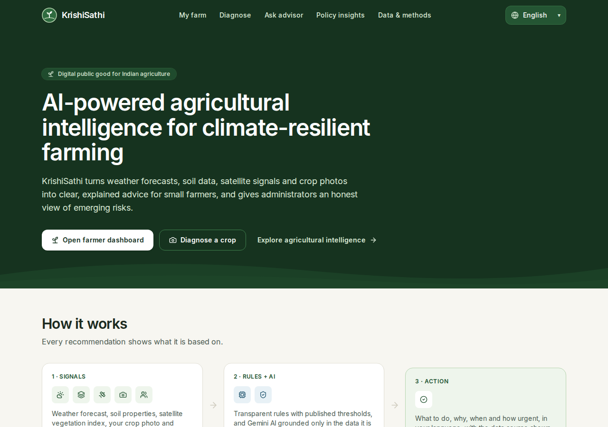
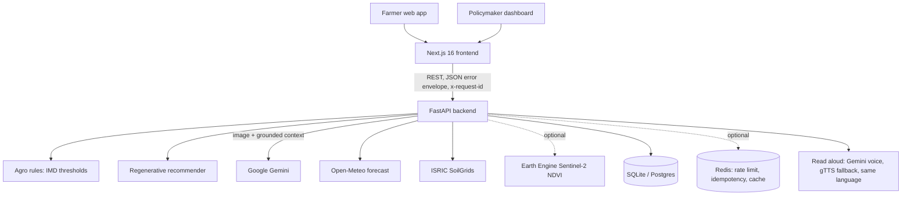

<div align="center">
  <h1>KrishiSathi (कृषि साथी)</h1>
  <p><strong>Trustworthy, multilingual agricultural intelligence for small farmers and the officials who support them.</strong></p>
  <p><a href="https://ai-krishisathi.vercel.app/">Live site</a> · <a href="#architecture">Architecture</a> · <a href="docs/AUDIT.md">Audit &amp; change log</a></p>
</div>

---



## What it does

| Farmers ask | KrishiSathi answers with | Based on |
|---|---|---|
| What should I do today? | Ranked risks and the one action that matters now | Open-Meteo forecast + published IMD thresholds |
| What will the weather do? | 7-day forecast translated into farming meaning (rain, heat, cold, fungal conditions, dry spells, spray wind) | Open-Meteo (model estimates, labelled as such) |
| What is wrong with my crop? | Diagnosis with **status** (disease / healthy / uncertain / not a plant), **certainty** (low / moderate / high), symptoms seen, alternatives and safe next steps | Gemini vision + curated ICAR disease reference |
| Something is wrong, where do I start? | One screen with seven plain choices (photo, pests, weather, water, slow growth, soil, "I don't know"), each routed to the right tool | Existing tools; no separate logic |
| How can I improve my soil? | Regenerative practices placed on the crop cycle (this season, next season, long-term), with why, what, when, benefit and the data behind them; the farmer can record adoption | ISRIC SoilGrids + Soil Health Card rating classes + forecast + FAO-56 crop stage |
| Which crops suit my area? | Water need, season length, verified disease guides and nearby clusters for the farm's crop and the state's crops. Not a ranking; prices shown as unavailable | FAO water-need and FAO-56 tables, ICAR reference, community reports |
| Is there a risk nearby? | Weather alerts and disease clusters reported within ~100 km | Forecast rules + anonymised, AI-classified farmer reports |
| Where are risks rising? (policymakers) | Early warning: disease signals per 0.5° area (new / rising / falling, confidence from the number of reports), per-state weather threats and an explicit "unavailable" for regional satellite anomalies. Every chart states period, geography, observations, source and limits, and flags thin data | Aggregated diagnoses (≥ 0.5° for signals, ~11 km for clusters) + forecast |

Ask by voice and the answer comes back short and spoken, grounded in the farm risk engine, with the text kept on screen. Offline, the app shows the last saved data clearly marked with its date, and queues farmer answers until the connection returns.

Available in English, हिन्दी, मराठी, தமிழ், తెలుగు, বাংলা, ಕನ್ನಡ, ગુજરાતી, ਪੰਜਾਬੀ and മലയാളം with native scripts and numerals.

## Real data only

KrishiSathi never fills a gap with invented numbers.

* If a source fails or is not configured, the UI shows an explicit **unavailable** state and the API returns an error or `{"status": "unavailable"}`. There is no demo mode and no mock fallback.
* Every panel shows its **provenance**: source, kind (model estimate, forecast, satellite observation, AI-generated, verified reference, rule-based) and time.
* AI output is always labelled and kept separate from verified data. Chemical treatments are shown only when the diagnosis matches the curated reference and certainty is not low. Everything else directs the farmer to their KVK.
* Satellite crop health is shown only when Earth Engine is configured. Regional crop-health aggregation is not implemented, so the policy dashboard says so.
* Diagnosis accuracy has **not** been measured on an Indian field dataset. `backend/scripts/validate_plantvillage.py` can measure it.

## Architecture


```mermaid
graph TD
    Farmer[Farmer web app] --> FE[Next.js 16 frontend]
    Policy[Policymaker dashboard] --> FE
    FE -->|REST, JSON error envelope, x-request-id| API[FastAPI backend]
    API --> Rules[Agro rules: IMD thresholds]
    API --> Regen[Regenerative recommender]
    API -->|image + grounded context| Gemini[Google Gemini]
    API --> OM[Open-Meteo forecast]
    API --> SG[ISRIC SoilGrids]
    API -.optional.-> EE[Earth Engine Sentinel-2 NDVI]
    API --> DB[(SQLite / Postgres)]
    API -.optional.-> Redis[(Redis: rate limit, idempotency, cache)]
    API --> TTS[Read aloud: Gemini voice, gTTS fallback, same language]
```

**Backend** (`backend/`): FastAPI, async SQLAlchemy + Alembic, pydantic v2.

* `core/`: error envelope `{"error": {"code", "message", "request_id", "retryable"}}`, request-ID and security-header middleware, rate limiting (Redis with an in-process fallback), JWT auth that fails closed.
* `services/`: weather, agro rules, soil, regenerative practices, Earth Engine, Gemini (timeouts, schema validation, prompt-injection fencing), grounding context, persistence.
* `routers/`:
  * farmer: `/api/farm/*`, `/api/diagnose`, `/api/advisory/*`, `/api/alerts`, `/api/kvk`
  * policymaker: `/api/dashboard/*`, `/api/states/*`
  * metadata: `/api/sources`, `/health/live`, `/health/ready`

**Frontend** (`frontend/`): Next.js 16 App Router, React 19, Tailwind v4.

* Pages: `/`, `/farm`, `/diagnose`, `/advisor`, `/dashboard`, `/about`.
* `lib/api.ts` gives typed calls with timeouts and parses the error envelope.
* `lib/i18n.tsx` lazily loads locales and formats numbers in native numerals.
* Charts and maps load lazily.

## Running locally

```bash
# Backend
cd backend
python3 -m venv .venv && source .venv/bin/activate
pip install -r requirements.txt
cp .env.example .env          # set GEMINI_API_KEY; everything else is optional
alembic upgrade head
uvicorn main:app --reload --port 8000     # docs at http://localhost:8000/docs

# Frontend (new terminal)
cd frontend
npm ci
cp .env.example .env.local    # NEXT_PUBLIC_API_URL=http://localhost:8000
npm run dev                   # http://localhost:3000
```

See `backend/.env.example` for the backend environment variables:

* `GEMINI_API_KEY` and model overrides
* `DATABASE_URL`, `REDIS_URL`
* `JWT_SECRET`
* `CORS_ALLOWED_ORIGINS` / `CORS_ALLOWED_ORIGIN_REGEX`
* `EE_SERVICE_ACCOUNT_KEY_JSON`, `EE_PROJECT` (Sentinel-2 via Earth Engine; setup in `docs/EARTH_ENGINE.md`)
* `AI_TIMEOUT_SECONDS`, `EXTERNAL_API_TIMEOUT_SECONDS`
* `GEMINI_TTS_MODEL`, `GEMINI_TTS_VOICE`, `GEMINI_TTS_LANGUAGES` (read-aloud voice)

The frontend needs `NEXT_PUBLIC_API_URL` **at build time**. If a deployed build still points at `http://localhost:8000`, every request fails; the UI now detects this and says "service configuration needs attention" rather than blaming the user's internet connection.

In `ENVIRONMENT=production` the backend requires a real database and Redis.

## Validation

```bash
# Backend. Tests never use DATABASE_URL: they migrate a throwaway SQLite file, or TEST_DATABASE_URL when set.
# The Postgres concurrency test runs only with a Postgres TEST_DATABASE_URL (CI provides one).
cd backend && python -m pytest -q

# Frontend
cd frontend
npm run lint
npm run typecheck
npm test                      # locale integrity, read-aloud state machine and voice choice, error classification
npm run build
npx playwright install chromium   # once
npm run test:e2e              # user journeys on desktop and Pixel 7, against recorded API fixtures
```

End-to-end tests serve the production build and answer every API call from `frontend/e2e/fixtures/api.json`. That fixture was recorded from the real backend routes, so the tests are deterministic and need no network.

To capture screenshots for visual QA, run `SCREENSHOTS=1 SCREENSHOT_LANG=hi npx playwright test screenshots --project=desktop`.

After changing a locale, run `node scripts/localize-digits.mjs` to convert ASCII digits to native numerals.

## Data sources

| Source | Use | Notes |
|---|---|---|
| [Open-Meteo](https://open-meteo.com) | Current conditions, 7-day forecast, soil moisture, ET₀ | Model estimates, not station readings |
| [ISRIC SoilGrids 2.0](https://soilgrids.org) | pH, organic carbon, clay, sand (0–15 cm) | 250 m predictions; not a field test |
| India Meteorological Department | Heavy-rain, heat and cold thresholds | Used in `services/agro_rules.py` |
| Soil Health Card scheme | pH and organic-carbon rating classes | Used in `services/soil_service.py` |
| Google Earth Engine (optional) | Sentinel-2 NDVI around the farm | Unavailable unless a service account is configured |
| Google Gemini | Photo diagnosis, advisory, transcription, policy briefing | Always labelled AI-generated |
| `backend/data/disease_reference.json` | Curated disease symptoms and management (ICAR institutes) | Small and growing |
| `backend/data/kvk_locations.json` | Krishi Vigyan Kendra for the nearest listed district (23 districts) | Coordinates are district headquarters, not KVK campuses, so no distance is shown; outside 60 km no KVK is claimed |

## Read aloud

One app-wide speech session (`frontend/src/lib/speech-core.ts`, wired in `lib/speech.ts`) drives every Read aloud button: *Read aloud → Preparing audio… → Stop*. Starting another answer stops the previous one; leaving the page stops it; late callbacks from a stopped session are ignored. Text is read in the language it was **written in**, not the current UI language.

Voice order: the Gemini speech model (natural, locale-pinned) for `GEMINI_TTS_LANGUAGES`; a high-quality on-device voice for the exact Indian locale if the server would only offer gTTS; then gTTS in the same language (Indian-accent English). An English voice is never used for Indic text. If no native voice is available the button says so.

## Error messages

`lib/api.ts` separates *offline*, *nothing reachable*, *server reachable but the request failed* (a no-cors probe of `/health/live`; this is what a CORS-blocked 500 or a platform timeout looks like), *timeout*, *rate limited* and *misconfigured API URL*. The backend adds CORS headers to its last-resort 500 envelope so real server errors are reported as such.

## Limitations

* Translations are careful but should be reviewed by native-speaking agronomists.
* Disease clusters reflect where the app is used and are AI-classified, not lab-confirmed.
* The policy dashboard uses one forecast point per state for weather risk, so it is indicative only.
* KVK data covers 23 districts with district-HQ coordinates. A verified national KVK dataset with campus coordinates is needed before distances can be shown.
* SoilGrids is a fair-use service (about 5 queries per minute per client). Answers are cached for 7 days (Redis) and rate-limit answers are backed off, but a cold, busy deployment can still see "service busy".
* District and disease names from the data sources are proper nouns and stay in their source spelling.
* Gemini speech language coverage should be confirmed against the current model documentation before adding languages to `GEMINI_TTS_LANGUAGES`.

## License

[Apache License 2.0](LICENSE). KrishiSathi is positioned as a Digital Public Good. Built by Varad Pandare (IIT Kharagpur) for the Google Build with AI Hackathon.
